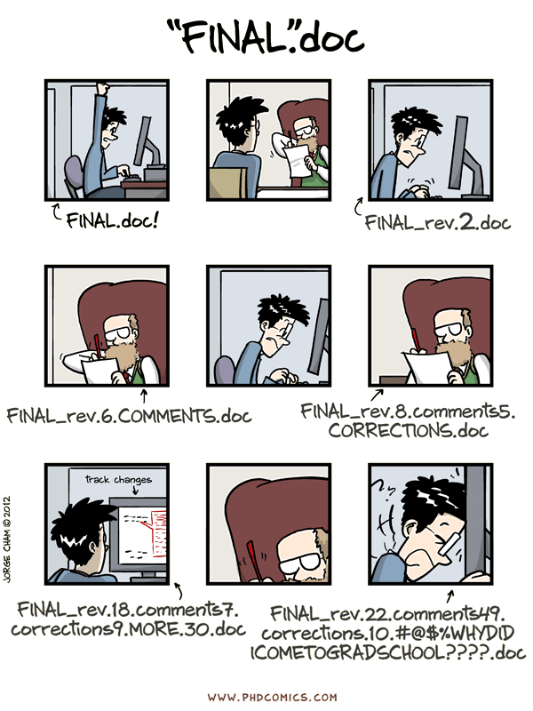
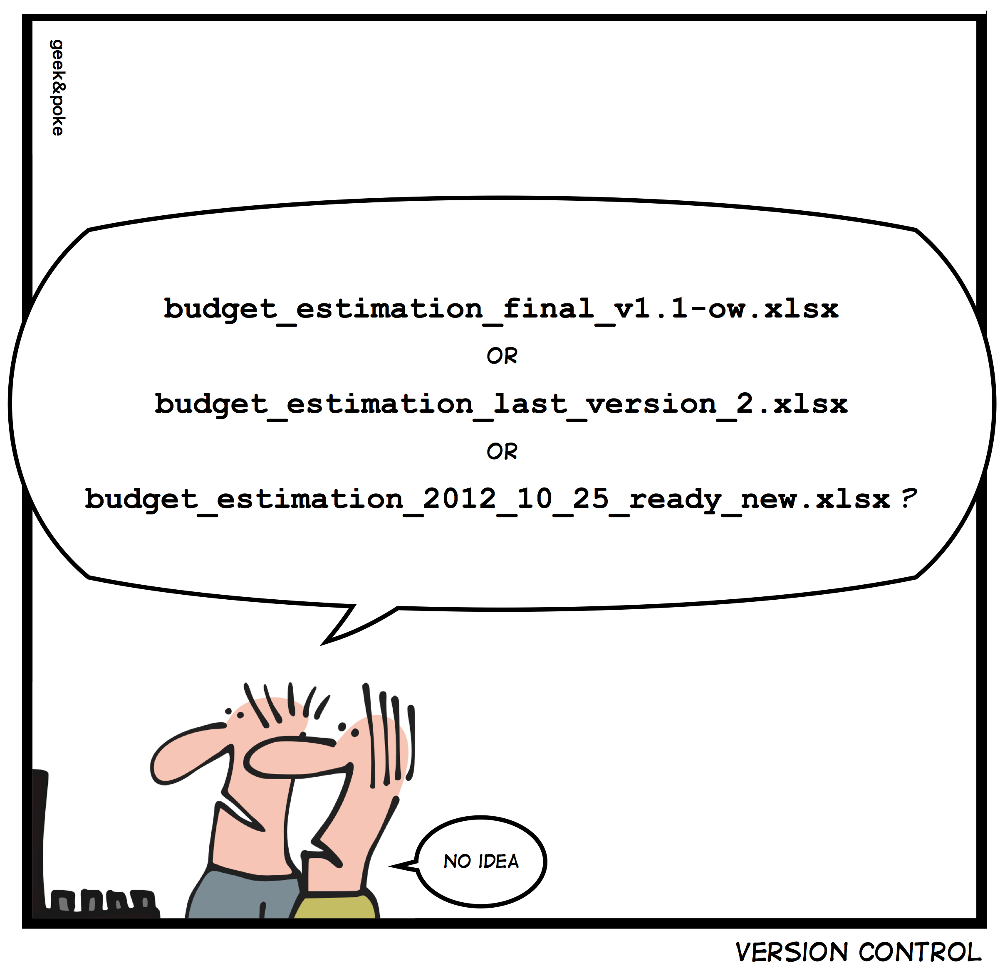
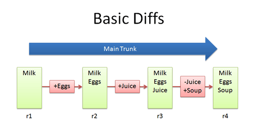
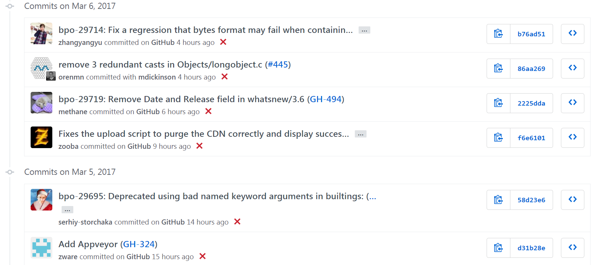
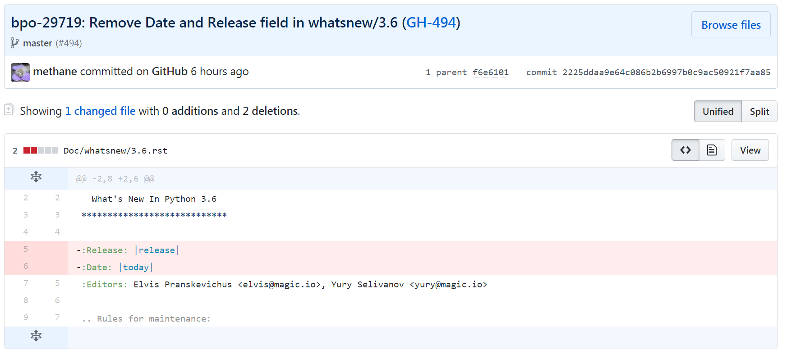
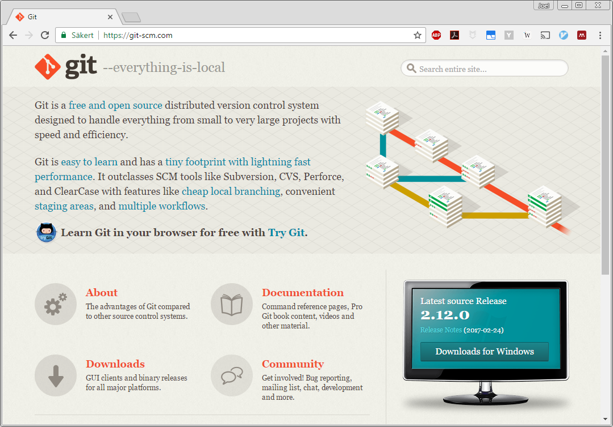
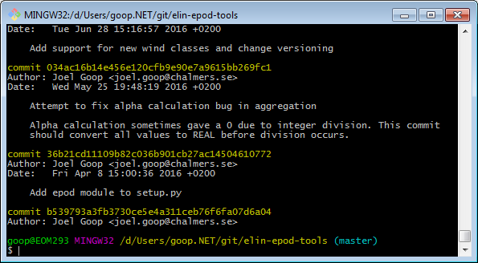
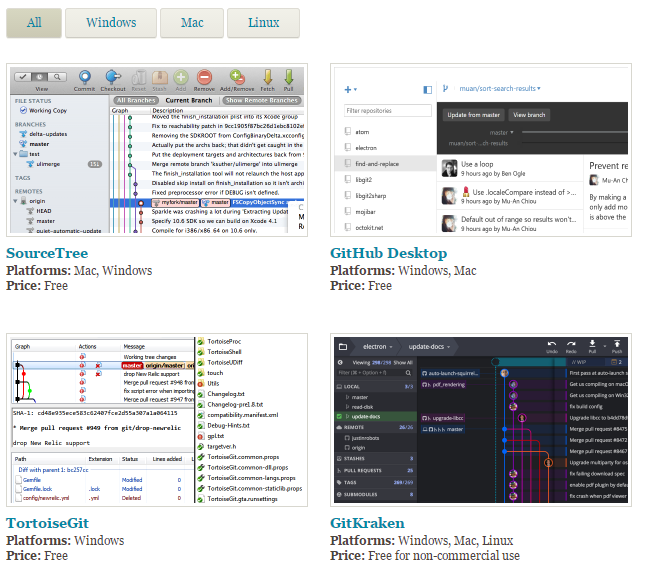
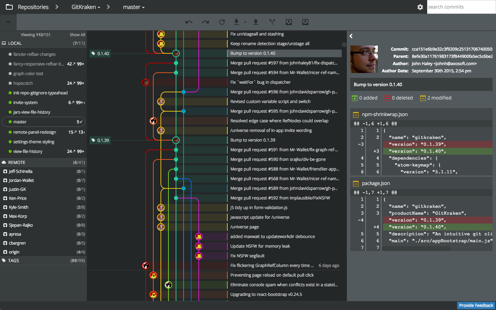
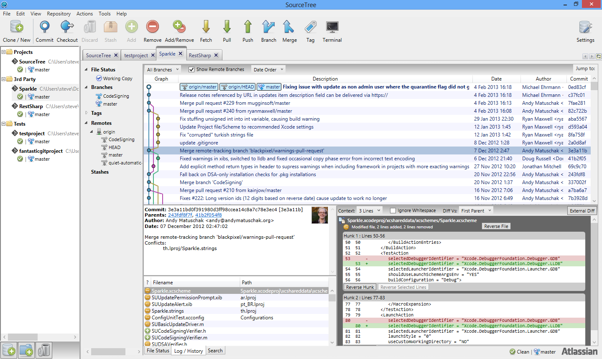

## Version control with `git`

Joel Goop

2017-03-09

---

### Familiar?

 <!-- .element: style="border: none; background: none; box-shadow: none; height: 500px" -->

----

### Problem

 <!-- .element: style="border: none; background: none; box-shadow: none; height: 500px" -->

----

### Solution: Version control!

- Store changes
- Works for any text-based content

 <!-- .element: style="border: none; background: none; box-shadow: none" -->

----

### Advantages: Changelog

"Commits": snapshots with messages

  <!-- .element: style="border: none; background: none; box-shadow: none; height: 400px" -->

----

### Example of commit

  <!-- .element: style="border: none; background: none; box-shadow: none; height: 400px; width: auto" -->

----

### Advantages: Branches and merging 

Different versions at the same time

  <!-- .element: style="border: none; background: none; box-shadow: none" -->

----

### Limitations

- Only works well for <span style="color: firebrick">raw text</span>
- Tracks changes <span style="color: firebrick">line-by-line</span>
- <span style="color: firebrick">Large files</span> (especially binary) can make it slow

---


## Git basics

----

### About `git`

- Version control tool (https://git-scm.com/)
  + <span style="color: forestgreen">Open-source</span>
  + Distributed/decentralized (?)

 <!-- .element: style="border: none; background: none; height: 300px; box-shadow: 10px 10px 35px 0px rgba(0,0,0,0.75);" -->

----

### Concepts 1

- Repository
    + Working copy
- Staging <!-- .element: class="fragment" data-fragment-index="1" -->
- Commit <!-- .element: class="fragment" data-fragment-index="2" -->
    + Message
    + Hash
    + Tag

Note:

- Explain each concept.
- Did anyone read guide?
- Some terms are used differently.


----


### Concepts 2

- Branch
    + Merge
- Remote <!-- .element: class="fragment" data-fragment-index="1" -->
    + Clone
    + Push/pull

Note:

- More about branches soon
- More about remotes later

----

### Basic usage

- Important commands
    + `git init`: Create a repository
    + `git clone`: Copy an existing repository
    + `git status`: Show uncommitted or staged files
    + `git add`: Stage files for commit
    + `git commit`: Commit staged files
- Ignore files (data files, logs, etc) <!-- .element: class="fragment" data-fragment-index="1" -->
    + Add to the file `.gitignore`: 
      ```
      *.pdf
      stuff/
      ```

Note:

Show example repository:

- Initialize
- Show status
- Add files
- Commit
- Create ignore file
- Commit
- Show log


----

### Remember: branches and merging 

  <!-- .element: style="border: none; background: none; box-shadow: none" -->

----

### Checkout and branches

- `git checkout`: Go to any commit
- `git checkout -b`: Create and go to a new branch
- `git merge`: Merge a branch into the current
- <span style="color: firebrick">Conflicts?!</span>

Note:

Show example repository:

- Create branch
- Change power to use built-in
- Add and commit
- Go to master
- Add comments
- Merge


---

## Useful features

----

### `git diff`: What has changed?

Show the changes between any two commits or between current working copy and last commit

```diff
public class Hello1
{
   public static void Main()
   {
-      System.Console.WriteLine("Hello, World!");
+      System.Console.WriteLine("Rock all night long!");
   }
}
```

Note:

Show in example repo

----

### `git log`: History

```bash
commit af26e9204f344b4ed5afb1e8fbbbc528dc1f8d42
Author: Joel Goop <joel.goop@chalmers.se>
Date:   Wed Apr 20 14:18:11 2016 +0200

    Fix string compatibility with python 3

commit 8361852ca5672754a48fd3a22363031eb380f684
Author: Joel Goop <joel.goop@chalmers.se>
Date:   Wed Apr 20 13:03:48 2016 +0200

    Re-add relative imports
```

Note:

Show in example repository (and ELIN/EPOD?).


---

## Collaborating using `git`


----

### `git` is decentralized

Every copy has the full history: <span style="color: forestgreen">all are equal</span>!

  <!-- .element: style="border: none; background: none; box-shadow: none; height: 450px" -->

----

### Remotes: Linked copies of repositories

- Another local folder, or
- Hosted service like `github` or `bitbucket`

  <!-- .element: style="border: none; background: none; box-shadow: none; height: 350px" -->

----

### How to use remotes

- `git remote add URL`
- `git push/pull`: sync with remote
- Conflicts must be <span style="color: firebrick">resolved locally</span>!
- Identify with `ssh` keys

----

### Benefits of hosted services 

- Backup and availability
- Web interface
- Permissions and access
- Additional tools
  + Issue tracking
  + Wiki

---

## Practical `git`

----

### Default is command-line

- Learn how `git` works!
- Graphical tools can be connected: diffs and merges

 <!-- .element: style="border: none; background: none; height: 350px; box-shadow: 10px 10px 35px 0px rgba(0,0,0,0.75);" -->

----

### Grahpical interfaces

- Easy to get overview and browse history
- Requires <span style="color: forestgreen">basic understanding of commands</span>!
- Many options available ([list here](https://git-scm.com/download/gui/win))

 <!-- .element: style="border: none; background: none; height: 350px; box-shadow: none;" -->

----

#### GUI example: GitKraken

 <!-- .element: style="border: none; background: none; height: 500px; box-shadow: 10px 10px 35px 0px rgba(0,0,0,0.75);" -->

----

#### GUI example: SourceTree

 <!-- .element: style="border: none; background: none; height: 500px; box-shadow: 10px 10px 35px 0px rgba(0,0,0,0.75);" -->

---

## Questions?
