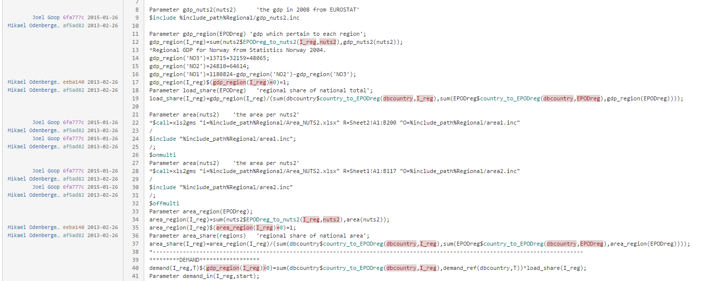

## Version control with `git`

Joel Goop

2017-03-09

---

### Familiar?

[<!-- .element: style="border: none; background: none; box-shadow: none; height: 500px" -->](http://www.phdcomics.com/comics/archive.php?comicid=1531) 

<!-- .element: style="font-size: 0.25em; margin-top: -2em" -->From "Piled Higher and Deeper" by Jorge Cham<br />http://www.phdcomics.com

----

### Problem

[ <!-- .element: style="border: none; background: none; box-shadow: none; height: 500px" -->](http://geek-and-poke.com/geekandpoke/2012/11/3/simply-explained.html)

<!-- .element: style="font-size: 0.25em; margin-top: -2em" -->From "Geek & Poke" by Oliver Widder, [CC BY 3.0](https://creativecommons.org/licenses/by/3.0/deed.en_US)

----

### Solution: Version control!

- Store changes
- Works for any text-based content

[ <!-- .element: style="border: none; background: none; box-shadow: none" -->](https://betterexplained.com/articles/a-visual-guide-to-version-control/)


<!-- .element: style="font-size: 0.25em; margin-top: -2em" -->From ["A Visual Guide to Version Control"](https://betterexplained.com/articles/a-visual-guide-to-version-control/) by Kalid Azad, [CC BY-NC-SA 3.0 US](https://creativecommons.org/licenses/by-nc-sa/3.0/us/)


----

### Advantages: Changelog

"Commits": snapshots with messages

  <!-- .element: style="border: none; background: none; box-shadow: none; height: 400px" -->

<!-- .element: style="font-size: 0.25em; margin-top: -2em" -->Screenshot from the `python`/`cpython` repository on GitHub<br />https://github.com/python/cpython/commits/master


----

### Example of commit

  <!-- .element: style="border: none; background: none; box-shadow: none; height: 400px; width: auto" -->

<!-- .element: style="font-size: 0.25em; margin-top: -2em" -->Screenshot from the `python`/`cpython` repository on GitHub<br />https://github.com/python/cpython/commit/2225ddaa9e64c086b2b6997b0c9ac50921f7aa85

----

### Advantages: Branches and merging 

Different versions at the same time

  <!-- .element: style="border: none; background: none; box-shadow: none" -->

<!-- .element: style="font-size: 0.25em; margin-top: -2em" -->From "An introduction to Git (part 4): Git branches"<br />http://codekarate.com/blog/introduction-git-part-4

----

### Limitations

- Only works well for <span style="color: darkorange">raw text</span>
  + Binary files have to be replaced on each change
- Tracks changes <span style="color: darkorange">line-by-line</span>, bad for
  + Large chunks of text on single lines
  + Table data (update column -> every line changes)
- <span style="color: firebrick">Large files</span> (especially binary) can make it slow

---


## Git basics

----

### About `git`

- Version control tool (https://git-scm.com/)
  + <span style="color: forestgreen">Open-source</span>
  + Distributed/decentralized (?)

 <!-- .element: style="border: none; background: none; height: 300px; box-shadow: 10px 10px 35px 0px rgba(0,0,0,0.75);" -->

<!-- .element: style="font-size: 0.25em; margin-top: -2em" -->Screenshot from http://git-scm.com

----

### Concepts 1

- Repository
    + Working copy
- Staging <!-- .element: class="fragment" data-fragment-index="1" -->
- Commit <!-- .element: class="fragment" data-fragment-index="2" -->
    + Message
    + Hash
    + Tag

Note:

- Explain each concept.
- Did anyone read guide?
- Some terms are used differently.


----


### Concepts 2

- Branch
    + Merge
- Remote <!-- .element: class="fragment" data-fragment-index="1" -->
    + Clone
    + Push/pull

Note:

- More about branches soon
- More about remotes later

----

### Basic usage

- Important commands
    + `git init`: Create a repository
    + `git clone`: Copy an existing repository
    + `git status`: Show uncommitted or staged files
    + `git add`: Stage files for commit
    + `git commit`: Commit staged files
- Ignore files (data files, logs, etc) <!-- .element: class="fragment" data-fragment-index="1" -->
    + Add to the file `.gitignore`: 
      ```
      *.pdf
      stuff/
      ```

Note:

Show example repository:

- Initialize
- Show status
- Add files
- Commit
- Create ignore file
- Commit
- Show log


----

### Remember: branches and merging 

  <!-- .element: style="border: none; background: none; box-shadow: none" -->

<!-- .element: style="font-size: 0.25em; margin-top: -2em" -->From "An introduction to Git (part 4): Git branches"<br />http://codekarate.com/blog/introduction-git-part-4

----

### Checkout and branches

- `git checkout`: Go to any commit
- `git checkout -b`: Create and go to a new branch
- `git merge`: Merge a branch into the current
- <span style="color: firebrick">Conflicts?!</span>

Note:

Show example repository:

- Create branch
- Change power to use built-in
- Add and commit
- Go to master
- Add comments
- Merge


---

## Useful features

----

### `git diff`: What has changed?

- Show changes between versions
  + Between any two commits, e.g. branches, or
  + Uncommitted changes since last commit

```diff
public class Hello1
{
   public static void Main()
   {
-      System.Console.WriteLine("Hello, World!");
+      System.Console.WriteLine("Rock all night long!");
   }
}
```

Note:

Show in example repo

----

### `git log`: History

```bash
commit af26e9204f344b4ed5afb1e8fbbbc528dc1f8d42
Author: Joel Goop <joel.goop@chalmers.se>
Date:   Wed Apr 20 14:18:11 2016 +0200

    Fix string compatibility with python 3

commit 8361852ca5672754a48fd3a22363031eb380f684
Author: Joel Goop <joel.goop@chalmers.se>
Date:   Wed Apr 20 13:03:48 2016 +0200

    Re-add relative imports
```

Note:

Show in example repository (and ELIN/EPOD?).


----

### `git blame`: Who did what when?


 <!-- .element: style="border: none; background: none; height: 360px; box-shadow: 10px 10px 35px 0px rgba(0,0,0,0.75);" -->

Note:

- Difficult to read raw output 
- Web interfaces/GUI shows nicely
- Example from bitbucket


---

## Collaborating using `git`


----

### `git` is decentralized

Every copy has the full history: <span style="color: forestgreen">all are equal</span>!

[  <!-- .element: style="border: none; background: none; box-shadow: none; height: 400px" -->](https://git-scm.com/book/en/v2/images/distributed.png)

<!-- .element: style="font-size: 0.25em; margin-top: -2em" -->From the ["Pro Git book", chapter 1.1](https://git-scm.com/book/en/v2/Getting-Started-About-Version-Control) written by Scott Chacon and Ben Straub, [CC BY-NC-SA 3.0](https://creativecommons.org/licenses/by-nc-sa/3.0/)<br />
https://git-scm.com/book/en/v2/images/distributed.png

----

### Remotes: Linked copies of repositories

- Another local folder, or
- Hosted service like `github` or `bitbucket`

  <!-- .element: style="border: none; background: none; box-shadow: none; height: 350px" -->

<!-- .element: style="font-size: 0.25em; margin-top: -2em" -->From the ["Pro Git book", chapter 1.1](https://git-scm.com/book/en/v2/Getting-Started-About-Version-Control) written by Scott Chacon and Ben Straub, [CC BY-NC-SA 3.0](https://creativecommons.org/licenses/by-nc-sa/3.0/)<br />
https://git-scm.com/book/en/v2/images/distributed.png

----

### How to use remotes

- `git remote add URL`
- `git push/pull`: sync with remote
- Conflicts must be <span style="color: firebrick">resolved locally</span>!
- Identify with `ssh` keys

----

### Benefits of hosted services 

- Web interface
- Backup and availability
- Permissions and access
- Additional tools
  + <span style="color: forestgreen">Issue tracking (!)</span>
  + Pull requests, code review, wiki...

---

## Practical `git`

----

### Command-line interface (included)

- Learn how `git` works!
- Graphical tools can be connected: diffs and merges

 <!-- .element: style="border: none; background: none; height: 350px; box-shadow: 10px 10px 35px 0px rgba(0,0,0,0.75);" -->

----

### Grahpical interfaces (install separately)

- Easy to get overview and browse history
- Requires <span style="color: darkorange">basic understanding of commands</span>!
- Many options available ([list here](https://git-scm.com/download/gui/win))

 <!-- .element: style="border: none; background: none; height: 350px; box-shadow: none;" -->

<!-- .element: style="font-size: 0.25em; margin-top: -2em" -->Screenshot from https://git-scm.com/download/gui/win

----

#### GUI example: GitKraken

[ <!-- .element: style="border: none; background: none; height: 500px; box-shadow: 10px 10px 35px 0px rgba(0,0,0,0.75);" -->](https://blog.axosoft.com/wp-content/uploads/2015/10/1-main-view.png)

<!-- .element: style="font-size: 0.25em; margin-top: -2em" -->From ["Axosoft GitKraken: Unleash Your Repo!"](https://blog.axosoft.com/2015/10/13/gitkraken-git-gui-client-mac-windows-linux/), written by John Sparrow<br />
https://blog.axosoft.com/wp-content/uploads/2015/10/1-main-view.png

----

#### GUI example: SourceTree

[ <!-- .element: style="border: none; background: none; height: 500px; box-shadow: 10px 10px 35px 0px rgba(0,0,0,0.75);" -->](http://blog.sourcetreeapp.com/files/2013/02/st_win8_beta.png)

<!-- .element: style="font-size: 0.25em; margin-top: -2em" -->From ["SourceTree for Windows beta signup"](https://blog.sourcetreeapp.com/2013/02/14/sourcetree-for-windows-beta-signup/), written by Justen Stepka<br />http://blog.sourcetreeapp.com/files/2013/02/st_win8_beta.png

---

## Questions?
